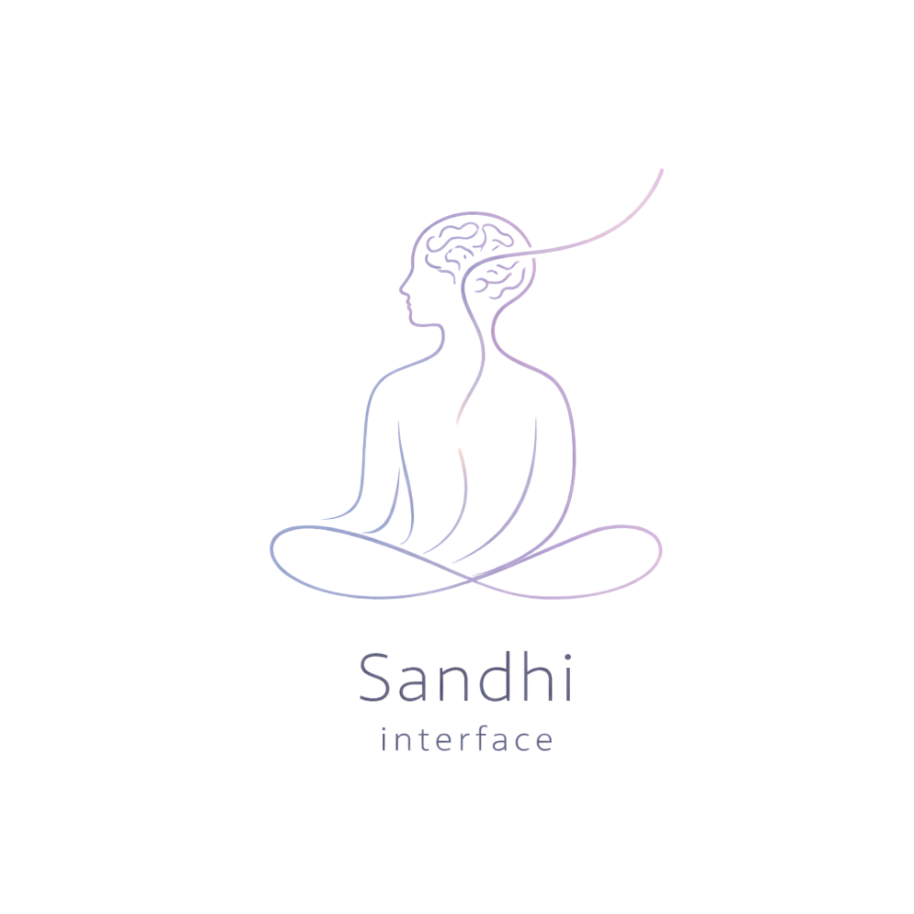

<div align="center">

<br/>



<br/><br/>

# Sandhi Interface

**¿Qué ocurre en el cerebro en el segundo previo a un impulso?**<br/>
*What happens in the brain in the second before an impulse?*

<br/>


[Research page](https://binivazqua.github.io/eno_love/) · [Support this research](#support--collaborate) · [Collaborate](#support--collaborate)

<br/>

</div>

---

## What is Sandhi?

*Saṃdhi* (संधि) — in Sanskrit, the point of union or transition between two states. Here: **the neural window between an impulse and a conscious action.**

Sandhi Interface is an independent applied neurotechnology research initiative exploring whether the Readiness Potential — the pre-conscious neural signature of an impending voluntary action — can serve as a measurable marker of pre-impulse states in people with impulse control disorders.

---

## Research question

> Can the Readiness Potential (RP) — detectable via EEG up to 2 seconds before conscious intent — be used to characterize pre-impulse neural states in conditions like anxiety, eating disorders, compulsive behavior, and self-harm?

Impulse control disorders share a common mechanism:

```
internal state → impulse → automatic action → loss of behavioral control
```

Clinical intervention almost always occurs *after* the behavior. Yet the neuroscience shows the brain prepares actions before conscious awareness of intent. **The pre-impulse window is measurable. Sandhi Interface is measuring it.**

---

## Scientific background

| Year | Finding | Relevance |
|------|---------|-----------|
| 1965 | Kornhuber & Deecke — Bereitschaftspotential | Slow cortical negativity beginning 1–2 s before voluntary movement, originating in the supplementary motor cortex. |
| 1983 | Libet et al. — conscious intent & motor preparation | Brain activity predicts felt "urge to move" by several hundred ms — revealing the unconscious initiation of voluntary acts. |
| 2005 | Kessler et al., NCS-R | 1 in 4 people worldwide will experience an impulse-related disorder in their lifetime. |
| 2008 | Haynes et al. — predictive decoding | Decision outcomes decoded from fMRI 7–10 s before conscious awareness, extending the pre-conscious window dramatically. |

**Our hypothesis:** Impulsive states manifest as detectable patterns of motor preparation — measurable via EEG — that differ significantly from controlled or inhibited responses.

---

## Methodology

**Hardware** — Neuroelectrics Enobio 8: wireless, 8-channel EEG, 24-bit resolution, 500 Hz sampling rate.

**Electrode placement** — `Cz` `FCz` `Fz` `C3` `C4` `F3` `F4` `Pz` — targeting primary motor cortex (M1), supplementary motor area, and prefrontal cortex.

**Electrode modalities** — Wet gel (Ag/AgCl) and dry gel electrodes. Active comparison of signal quality across both.

**Software stack** — NIC2 for acquisition · MNE-Python for analysis · Python pipeline (scipy, matplotlib, numpy)

**Paradigms**

| Condition | Code | Description |
|-----------|------|-------------|
| Rest Eyes Open | `EO` | Baseline resting state |
| Rest Eyes Closed | `EC` | Baseline resting state |
| Motor Imagery | `MI` | Imagined movement, no physical execution |

**Experimental phases**

| Phase | Name | Description |
|-------|------|-------------|
| I | Spontaneous RP characterization | Free-movement paradigm. Baseline acquisition and pipeline validation. |
| II | Go / No-Go inhibitory control | Compare pre-motor activity between executed and inhibited responses. |
| III | Impulsivity EEG markers | Differentiate neural patterns preceding controlled vs. impulsive actions. |

**Signal analysis strategy** — temporal segmentation · spectral power analysis · SCP/RP extraction · cross-condition comparison

---

## Repository structure

```
sandhi-interface/
├── edf_conv.py           ← batch format comparison + reporting
├── easy_edf_graph.py     ← visual + statistical deep dive (single pair)
├── requirements.txt
├── docs/                 ← GitHub Pages site
│   ├── index.html
│   └── sandhi-logo.png
├── data/                 ← raw EEG sessions (not tracked in git)
├── comparison_reports/   ← analysis outputs
└── research_log/         ← chronological field notes
```

### `edf_conv.py`
Batch pairwise comparison of `.easy` / `.edf` file pairs from a NIC2 session directory. Auto-detects `.easy`-only batches and falls back gracefully.

**Outputs:** `*_channels.csv` · `*.json` · `*.md`

### `easy_edf_graph.py`
Deep visual and statistical comparison for a specific file pair. Signal overlays, power spectra, per-channel stats, heatmap.

**Outputs:** `*_raw_overlay.png` · `*_demeaned_overlay.png` · `*_histograms.png` · `*_stats_heatmap.png` · `*.csv` · `*.json`

---

## Setup

```bash
git clone https://github.com/binivazqua/eno_love.git
cd eno_love
python -m venv eno_venv
source eno_venv/bin/activate
pip install -r requirements.txt
```

### Batch comparison

```bash
./eno_venv/bin/python edf_conv.py \
  --data-dir data/session_XXX \
  --output-dir comparison_reports/session_XXX
```

### Visual deep dive

```bash
./eno_venv/bin/python easy_edf_graph.py \
  --easy  data/session_XXX/recording.easy \
  --edf   data/session_XXX/recording.edf \
  --info  data/session_XXX/recording.info \
  --output-dir comparison_reports/session_XXX_graphs
```

### Reading the outputs

| Signal | Interpretation |
|--------|---------------|
| `mean_correlation → 1.0` + `rmse → 0` in `.easy`-only mode | Format consistency confirmed — not a physiological quality metric. |
| Stable `sfreq` and duration across sessions | Good acquisition stability. |
| Outlier `std` or `peak-to-peak` in a channel | Check electrode contact; candidate for exclusion. |
| Consistent metrics across condition repetitions | Reproducible paradigm execution. |

### Data integrity pre-check

```bash
find data/session_XXX -type f \( -name '*.easy' -o -name '*.edf' -o -name '*.info' \) | sort
wc -l data/session_XXX/*.easy
# Files at 0 lines or 0B → exclude and flag for re-recording
```

---

## Team

**Biniza Verónica Vázquez Moreno** — Principal Investigator  
Robotics and Systems Engineering · Tecnológico de Monterrey Campus Puebla  
Premio Mujer Tec 2026 · g.tec BR4IN.IO Spring School 2026 (€1,000 prize)

**Contributors**
- Linda Michelle Silva Ramos — Research Interface Specialist · Mechatronics Engineering (8th semester) · Physical & UI interface for RP measurement
- Gianluca de la Rosa Bandini — Research Interface Specialist · Mechatronics Engineering (8th semester) · Physical & UI interface for RP measurement
- Sofía Navarro Rebolledo — Human Factors Research Assistant · Future neuroscientist · High school senior

**Advisors**
- Dr. Ana Luisa Santaolalla — Harvard Neuroscience · Hult MBA
- Yolanda Fajardo — Clinical Psychologist, Founder of Serena Mente Puebla
- Dr. Christoph Guger — Founder & CEO, g.tec biomedical engineering

---

## Support & collaborate

This research is **entirely self-funded and independently conducted.**

**Fund the next hardware** → GoFundMe *(coming soon)*  
We won €1,000 at g.tec BR4IN.IO Spring School 2026 — a real start. Our crowdfunding goal is the **Unicorn Hybrid Black** (g.tec): active dry electrodes, higher channel density, purpose-built for RP research. Every contribution gets us closer.

**Collaborate** → [Open an issue](https://github.com/binivazqua/eno_love/issues)  
Backgrounds welcome: neuroscience, clinical psychology, robotics, signal processing. Replication, protocol review, and co-authorship conversations are open.

**Use the tools** → If you work with Neuroelectrics hardware, these scripts are yours. PRs welcome.

---

## References

1. Kornhuber, H.H., & Deecke, L. (1965). Bereitschaftspotential und reafferente Potentiale. *Pflügers Archiv, 284*, 1–17.
2. Libet, B., Gleason, C.A., Wright, E.W., & Pearl, D.K. (1983). Time of conscious intention to act in relation to onset of cerebral activity. *Brain, 106*(3), 623–642.
3. Haynes, J.D., et al. (2008). Reading hidden intentions in the human brain. *Current Biology, 17*(4), 323–328.
4. Kessler, R.C., et al. (2005). Lifetime prevalence and age-of-onset distributions of DSM-IV disorders in the NCS-R. *Archives of General Psychiatry, 62*(6), 593–602.
5. Uhlhaas, P.J., & Singer, W. (2006). Neural synchrony in brain disorders. *Neuron, 52*(1), 155–168.
6. Gramfort, A., et al. (2013). MEG and EEG data analysis with MNE-Python. *Frontiers in Neuroscience, 7*, 267.

---

<div align="center">

*"The readiness potential begins long before we feel the intention to move.<br/>What does the brain know that the mind hasn't said yet?"*

<br/>

**Sandhi Interface** · Independent EEG Research · Puebla, México

</div>
